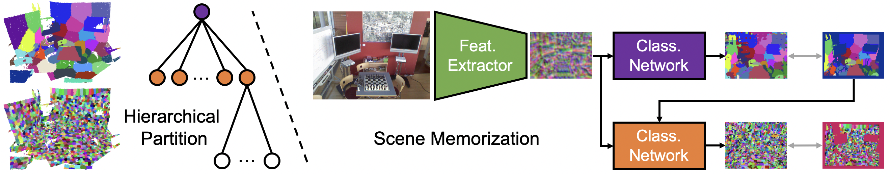
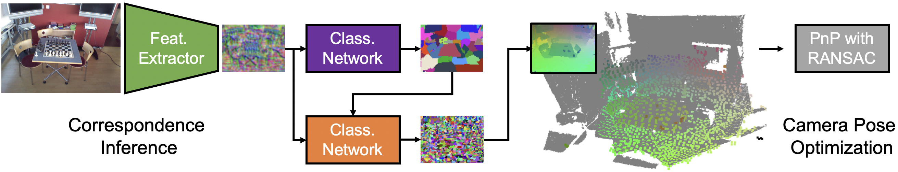

# [3DV 2022] [Visual Localization via Few-Shot Scene Region Classification](https://arxiv.org/pdf/2208.06933.pdf)

*[Siyan Dong](https://siyandong.github.io/), *[Shuzhe Wang](https://ffrivera0.github.io/), [Yixin Zhuang](https://yixin26.github.io/), 
[Juho Kannala](https://users.aalto.fi/~kannalj1/), [Marc Pollefeys](https://people.inf.ethz.ch/pomarc/), [Baoquan Chen](http://cfcs.pku.edu.cn/baoquan/)

\* Equal Contribution | [Video](https://www.youtube.com/watch?v=XyiRQs_3pFo&t) | [Poster](https://drive.google.com/file/d/1qxxfoTPkUik9ryIoH6hCSwkhq4MOXUBQ/view?usp=sharing)

In this paper, we propose a scene region classification approach to achieve fast and effective scene memorization with few-shot images for scene coordinate based visual localization. Our insight is leveraging a) pre-learned feature extractor, b) scene region classifier, and c) meta-learning strategy to accelerate training while mitigating overfitting. We evaluate our method on both indoor and outdoor benchmarks. The experiments validate the effectiveness of our method in the few-shot setting, and the training time is significantly reduced to only a few minutes.


The training pipeline: a hierarchical partition tree is built to divide the scene to regions, and then a neural network is trained to map input image pixels to region labels. The network is designed to leverage both scene-agnostic priors (i.e., the feature extractor SuperPoint) and scene-specific memorization (i.e. the classifier that consists of hierarchical classification networks).


The camera pose estimation pipeline: given a query image, the trained network infers correspondences between image pixels and scene regions. Since each scene region corresponds to a set of scene coordinates, 2D-3D correspondences are built between image pixels and scene coordinates. Followed by a PnP algorithm with RANSAC, the camera pose is solved by optimization.

### Results

We provide our camera pose accuracy on the 7-Scenes dataset and Cambridge landmarks. Note that for both few-shot and original (full-training set) memorization, we use the same network capacity (∼40 MB). 

| Median Error (cm / deg) | Chess | Fire | Heads | Office | Pumpkin | RedKitchen | Stairs |
| :---: | :---: | :---: | :---: | :---: | :---: | :---: | :---: |
| Few-Shot Training | 4 / 1.23 | 4 / 1.53	| 2 / 1.56 | 5 / 1.47 | 7 / 1.75 | 6 / 1.93 | 5 / 1.47 |
| Original Training | 3 / 0.79 | 3 / 1.03	| 2 / 0.98 | 4 / 0.94 | 4 / 1.10	| 6 / 1.39 | 4 / 1.12 |

| Median Error (cm / deg) | Great Court | King's College | Old Hospital | Shop Facade | St Mary's Church |
| :---: | :---: | :---: | :---: | :---: | :---: |
| Few-Shot Training | 81 / 0.47 | 39 / 0.69 | 38 / 0.54 | 19 / 0.99 | 31 / 1.03 |
| Original Training | 39 / 0.21 | 21 / 0.37 | 23 / 0.37 | 5 / 0.26  | 14 / 0.41 |


## Setup

We recommend to use a conda environment:

1. Install anaconda or miniconda.

2. Create the environment: `conda env create -f environment.yml`.

3. Activate the environment: `conda activate SRC`.

4. To run the evaluation script, you will need to build the cython module:

   ```
   cd ./pnpransac
   python setup.py build_ext --inplace
   ```


## Data

You can download the [7Scene](https://www.microsoft.com/en-us/research/project/rgb-d-dataset-7-scenes/) and [Cambridge](https://www.repository.cam.ac.uk/handle/1810/251342;jsessionid=839DB68EBBE095D30318C7A1B61DC875) datasets from the official website for training and evaluation. we also provide additional necessary information [here](https://drive.google.com/drive/folders/1aQYlGh-e9dXnXjh5VI8OSvY-SLxUM4vw?usp=sharing) for few-shot training, the depth maps we used for Cambridge dataset are from [DSAC++](https://github.com/vislearn/LessMore). Note that you can directly use the provided ``` .label_n*.png``` and ``` _leaf_coords_n*.npy``` to reproduce our results. If you select to run ```partition.py``` to create your own region labels, please replace the provided  ``` _leaf_coords_n*.npy```  with the generated one. 

Downloading the [12Scene](https://graphics.stanford.edu/projects/reloc/) dataset for pretraining is optional.


## Model

You can download the pretrained models [here](https://drive.google.com/drive/folders/1XGXEcv02TApyXi8TENOHTYbjxs9ZDtds?usp=sharing), the optimizers are also included in the models.


## 7-Scenes 

### Training

#### Hierarchical Partition (Optional)

```
python partition.py --data_path Path/to/download/dataset --dataset 7S --scene chess --training_info train_fewshot.txt --n_class 64 --label_validation_test True
```

#### Scene Memorizarion

```
python train.py --data_path Path/to/download/dataset --dataset 7S --scene chess --training_info train_fewshot.txt --n_class 64 --train_id ???
```


### Test
```
python eval.py --data_path Path/to/download/dataset --dataset 7S --scene chess --test_info test.txt --n_class 64 --checkpoint checkpoints/???
```


## Cambridge Landmarks

### Training

#### Hierarchical Partition  (Optional)

```
python partition.py --data_path Path/to/download/dataset --dataset Cambridge --scene GreatCourt --training_info train_fewshot.txt --n_class 100 --use_gpu False
```

#### Scene Memorizarion

```
python train.py --data_path Path/to/download/dataset --dataset Cambridge --scene GreatCourt --training_info train_fewshot.txt --n_class 100 --train_id ???
```


### Test
```
python eval.py --data_path Path/to/download/dataset --dataset Cambridge --scene GreatCourt --test_info test_Cambridge.txt --n_class 100 --checkpoint checkpoints/???
```


## Pre-Training on 12-Scenes Dataset
```
python pretrain_12S.py --data_path Path/to/download/dataset --training_info train_20f.txt --n_class 64 --train_id ???
```
```
python pretrain_12S.py --data_path Path/to/download/dataset --training_info train_20f.txt --n_class 100 --train_id ???
```


## Acknowledgements

We appreciate the previous open-source repositories [DSAC++](https://github.com/vislearn/LessMore) and [HSCNet](https://github.com/AaltoVision/hscnet).


## Citation

If you find our work helpful in your research, please consider citing:
```
@INPROCEEDINGS{10044413,
  author={Dong, Siyan and Wang, Shuzhe and Zhuang, Yixin and Kannala, Juho and Pollefeys, Marc and Chen, Baoquan},
  booktitle={2022 International Conference on 3D Vision (3DV)}, 
  title={Visual Localization via Few-Shot Scene Region Classification}, 
  year={2022},
  volume={},
  number={},
  pages={393-402},
  doi={10.1109/3DV57658.2022.00051}}

```

